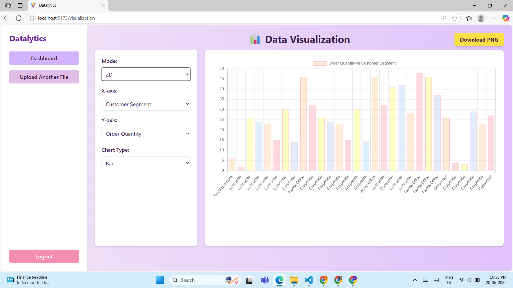
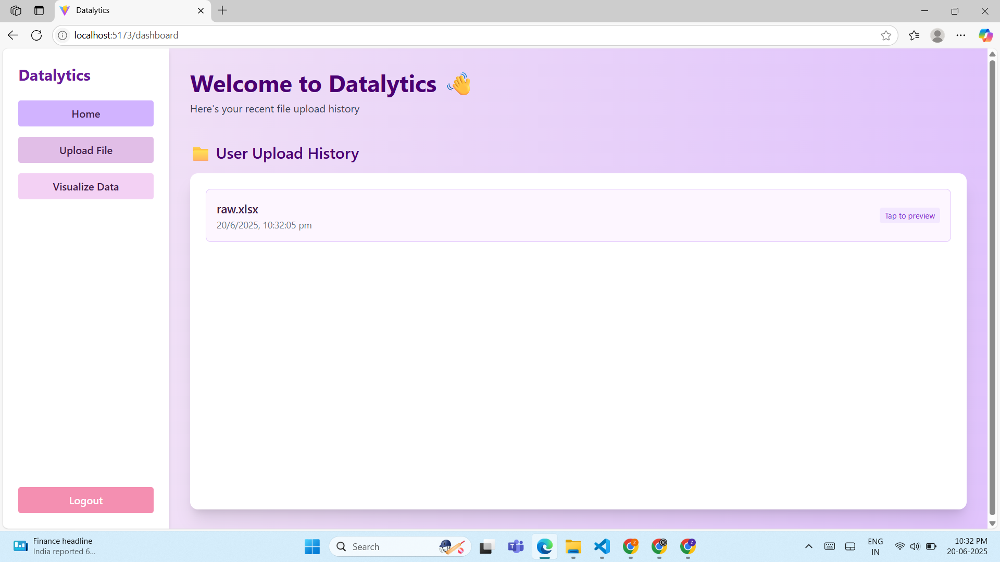
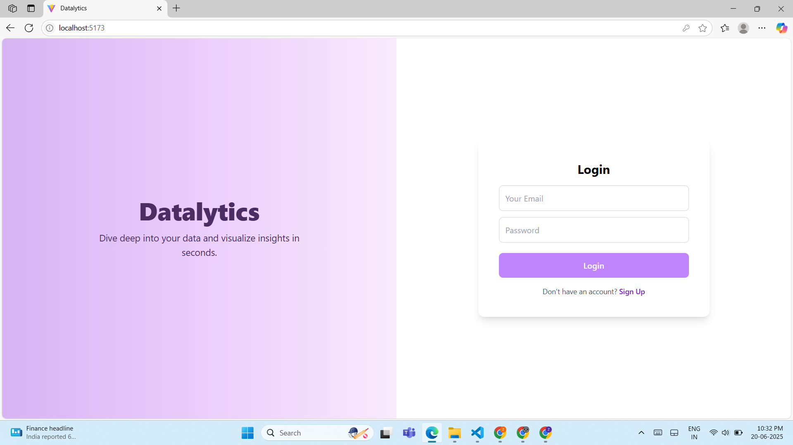
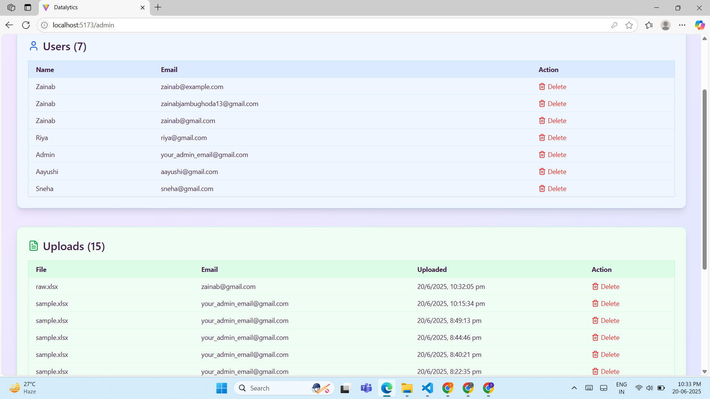

# 📊 Datalytics - Excel Data Analytics & Visualization Platform

**Datalytics** is a full-stack web application that allows users to upload Excel files, visualize data using 2D and 3D charts, and gain AI-powered insights. Designed with simplicity and interactivity in mind, it’s perfect for quick data exploration and presentation.

---

## 🚀 Features

- 🔐 **Authentication** – Login/Register securely
- 📁 **Excel Upload** – Upload `.xlsx` files directly from your dashboard
- 📈 **2D & 3D Charts** – Visualize with Bar, Line, Pie, Radar (Chart.js) and 3D Bar (Three.js)
- 🤖 **AI Insights** – Get automatic summaries of your data
- 🕓 **Upload History** – Track your past uploads with previews
- 👩‍💼 **Admin Panel** – Manage users and uploaded files
- 📥 **Chart Export** – Download charts as PNG images

---

## 🛠️ Tech Stack

### Frontend:
- React.js + TailwindCSS
- Chart.js + react-chartjs-2
- Three.js via React Three Fiber
- html2canvas (for chart screenshots)
- React Router

### Backend:
- Node.js + Express.js
- MongoDB + Mongoose
- Multer (file uploads)
- xlsx (Excel parsing)
- dotenv

---

---
##Pictures

## 🔧 Setup Instructions

### 1. Clone the repository
git clone https://github.com/zainab1305/Datalytics.git
cd backend
npm install
cp .env.example .env
## Fill in Mongo URI and other values
npm start

cd frontend
npm install
npm run dev

## MongoDB connection string
MONGO_URI=your_mongo_uri

## Port
PORT=5001

## Admin Access
Admin Email: your_admin_email@gmail.com (hardcoded for demo)

## Future Improvements:
- Export to PDF

- Shareable links for charts

- Custom themes

- User roles and permissions